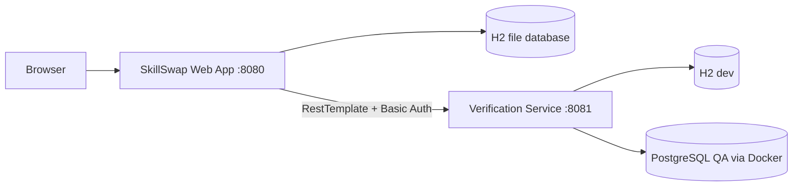

# SkillSwap Academy

SkillSwap Academy is a CPAN-228 Spring Boot project for discovering and managing community workshops. The repository contains:

1. **Primary web application** (root project, port `8080`)
2. **Skill Verification microservice** (`skill-verification-service`, port `8081`)

## Feature coverage

### Deliverable 1 — Front-End & Database

- Home, About, How It Works, workshop catalogue, detail, and form pages
- Thymeleaf templates and consistent Bootstrap styling
- Validated workshop form with required, numeric range, category, and level rules
- H2 file database through Spring Data JPA
- Generated IDs and timestamps
- Server-side search, category/level filtering, sorting, and pagination
- Realistic records loaded from `data.sql`

### Deliverable 2 — Security

- Registration saves users in the database
- BCrypt password encoding
- `AppUser` implements `UserDetails`
- Roles: `ADMIN`, `INSTRUCTOR`, `STUDENT`
- Public pages remain open; create and admin actions are protected
- Custom styled login page with errors
- Admin-only workshop edit/delete interface
- Logged-in member and role shown on the dashboard

### Deliverable 3 — Microservices, REST, Profiles, and Docker

- Separate verification service with its own entities, repository, logic, and database
- REST endpoints: GET all, GET by ID, POST, PUT, DELETE
- Custom multi-parameter endpoint: `/api/verifications/search?skillName=Java&status=APPROVED&minScore=70`
- HTTP Basic authentication independent from the main app
- `dev` profile uses H2 and `data-dev.sql`
- `qa` profile uses PostgreSQL and `data-qa.sql`
- Docker Compose starts the QA PostgreSQL database
- Main app calls the microservice using `RestTemplate`
- Admin dashboard displays local workshops and remote verification records
- Graceful fallback when the microservice is unavailable

## Requirements

- Java 21
- Maven Wrapper included for the primary application
- Docker Desktop only for the QA profile

## Run the primary application

From the repository root:

```bash
# macOS/Linux
chmod +x mvnw
./mvnw spring-boot:run

# Windows
mvnw.cmd spring-boot:run
```

Open `http://localhost:8080`.

## Run the microservice in dev mode

Open a second terminal:

```bash
cd skill-verification-service
../mvnw spring-boot:run
```

The service starts at `http://localhost:8081`. Its endpoints require HTTP Basic authentication.

- Username: `primary-app`
- Password: `skillswap-api-secret`

Example:

```bash
curl -u primary-app:skillswap-api-secret http://localhost:8081/api/verifications
```

## Run the QA profile with PostgreSQL

```bash
cd skill-verification-service
docker compose up -d
../mvnw spring-boot:run -Dspring-boot.run.profiles=qa
```

The PostgreSQL container is exposed on host port `5433`.

To stop it:

```bash
docker compose down
```

## Demo accounts

| Role | Email | Password |
|---|---|---|
| Admin | `admin@skillswap.ca` | `Admin123!` |
| Instructor | `instructor@skillswap.ca` | `Instructor123!` |
| Student | `student@skillswap.ca` | `Student123!` |

Public registration always creates a Student account. This prevents users from granting themselves administrative permissions.

## Architecture



## Important project structure

```text
src/main/java/ca/humber/skillswap/
  config/          Security, RestTemplate, seed accounts
  controller/      MVC and admin controllers
  integration/     Microservice DTOs and client
  model/           JPA entities and enums
  repository/      Spring Data repositories
  service/         Business and search logic

skill-verification-service/
  src/main/java/ca/humber/verification/
  src/main/resources/application-dev.yml
  src/main/resources/application-qa.yml
  docker-compose.yml
```

## Testing

Run both test suites:

```bash
./mvnw test
./mvnw -f skill-verification-service/pom.xml test
```

## Submission notes

- This is a solo project. `TEAM_CONTRIBUTIONS.md` identifies Shacquile Bray-Telesford as the sole developer for every deliverable.
- Confirm that the GitHub repository contains genuine, incremental commits authored by you. The completed ZIP cannot create or replace your existing GitHub commit history.
- Record a short video showing: public pages, invalid form errors, valid database save, search/filter/sort, registration/login, role restrictions, admin edit/delete, running microservice, remote data on the admin dashboard, and graceful behavior after stopping the microservice.
- Both applications are already inside the same repository.
